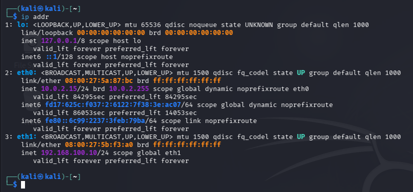
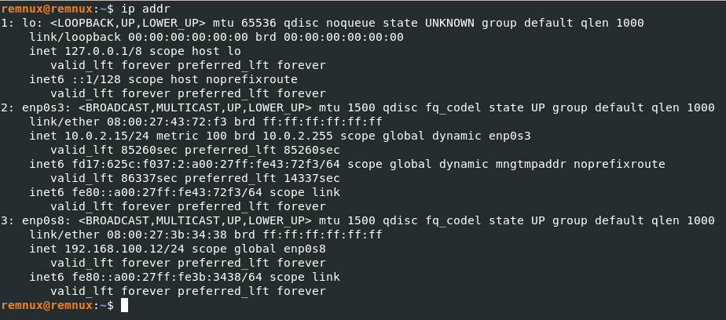
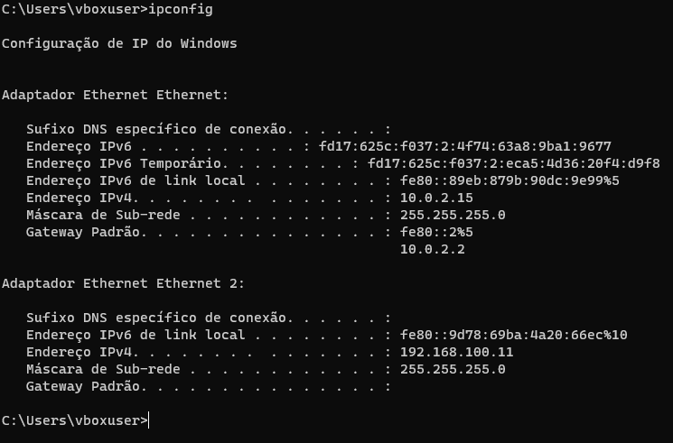
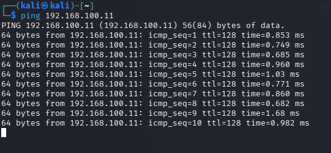
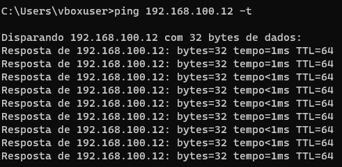
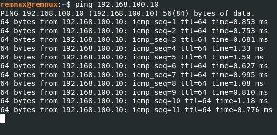

# Lab Environment

## Overview

This project documents the setup of a virtualized cybersecurity laboratory designed for security analysis and investigation activities.
The laboratory provides a controlled environment for analyzing security artifacts, network traffic, logs, and potentially malicious files.

## Virtualization Platform

- VirtualBox

## Virtual Machines

- REMnux
- Windows
- Kali Linux

## Security Considerations

The laboratory is designed with isolation and controlled execution in mind. Virtual machines are used to separate analysis activities from the host environment.
Snapshots are used to preserve clean states before performing potentially risky analysis.

## Objective

The objective of this laboratory is to provide a controlled and reproducible environment for practical cybersecurity investigations and security analysis.

---

## Progress

### Phase 1 — Virtual Machines Setup ✅
- [x] VirtualBox installed and configured
- [x] REMnux, Kali Linux, and Windows VMs created
- [x] VMs updated

### Phase 2 — Network Architecture ✅

Each virtual machine is configured with two network interfaces:

- **Adapter 1 (NAT):** Provides internet access for updates and tool installation.
- **Adapter 2 (Internal Network — "SOC-LAB"):** Connects all VMs to an isolated internal network named `SOC-LAB`, allowing them to communicate with each other without exposing traffic to the host network or the internet.

This dual-interface setup allows the lab to simulate realistic network interactions (e.g., traffic between an attacker machine and a target machine) while keeping the environment fully isolated from the host and external networks.

- [x] Second network adapter configured on all VMs
- [x] Internal network created (`SOC-LAB`)
- [x] Dual-interface setup: NAT (internet access) + Internal Network (isolated inter-VM communication)

| VM | Role | Adapter 1 (NAT) | Adapter 2 (Internal Network: SOC-LAB) |
|---|---|---|---|
| Kali Linux | Attack/analysis machine | ✅ | ✅ |
| Windows | Target/victim machine | ✅ | ✅ |
| REMnux | Malware analysis machine | ✅ | ✅ |

### Phase 3 — Connectivity Validation ✅

With static IP addresses assigned on the `SOC-LAB` internal network, connectivity between all virtual machines was tested and confirmed.

**Note:** Since VirtualBox Internal Networks do not provide DHCP, static IP addresses had to be manually assigned on each VM.

**Assigned IP addresses:**

| VM | Interface | IP Address |
|---|---|---|
| Kali Linux | eth1 | 192.168.100.10 |
| Windows | Ethernet 2 | 192.168.100.11 |
| REMnux | enp0s8 | 192.168.100.12 |

**Troubleshooting note 1 — Windows Firewall:** Initial ping tests from Kali/REMnux to Windows failed, while Windows could successfully ping the Linux machines. This was caused by the Windows Defender Firewall blocking inbound ICMP Echo Requests by default. The issue was resolved by enabling the *"File and Printer Sharing (Echo Request - ICMPv4-In)"* inbound rule in Windows Firewall with Advanced Security.

**Troubleshooting note 2 — Persisting static IPs:** Initial IP configuration was applied temporarily via `ip addr add`, which does not survive a reboot. To make the configuration persistent, each system required a different approach depending on its network management stack:

| VM | Network manager | Method used |
|---|---|---|
| Kali Linux | NetworkManager | `nmcli connection modify` |
| REMnux | Netplan | YAML configuration in `/etc/netplan/` |
| Windows | Native TCP/IPv4 settings | Static IP set via GUI (persistent by default) |

Even though Kali and REMnux are both Debian-based distributions, they use different network management stacks — a detail confirmed through direct troubleshooting rather than assumption.

**Validation results:**
- [x] Kali Linux ↔ Windows — successful
- [x] REMnux ↔ Windows — successful
- [x] Kali Linux ↔ REMnux — successful
- [x] Static IP configuration persists after reboot (all VMs)








### Phase 4 — Remote Access Configuration (SSH) ✅

To support remote access between VMs (used in later projects, such as network traffic analysis), SSH was configured and validated across all three machines.

**Setup:**
- [x] OpenSSH Server enabled on Kali Linux (`sudo systemctl enable --now ssh`)
- [x] OpenSSH Server enabled on REMnux (`sudo systemctl enable --now ssh`)
- [x] OpenSSH Server installed and enabled on Windows (via Windows Features → "Servidor OpenSSH")

**Troubleshooting note 1 — Network profile blocking inbound connections:** After enabling the OpenSSH Server on Windows, inbound SSH connections were refused. The cause was the `SOC-LAB` network being classified as **Public** by Windows, while the auto-created firewall rule (`OpenSSH-Server-In-TCP`) only applies to the **Private** profile. This was resolved by manually setting the network category:
```powershell
Set-NetConnectionProfile -InterfaceAlias 'Ethernet 2' -NetworkCategory Private
```
**Note:** Since this internal network has no gateway, Windows cannot always reliably auto-classify it, and the profile may need to be re-checked after a VM reboot.

**Troubleshooting note 2 — Blank password blocking authentication:** Even after the firewall and network profile were correctly configured, SSH connections to Windows still failed silently. The cause was that the local Windows account (`vboxuser`) had no password set — by default, OpenSSH on Windows rejects authentication for accounts with a blank password. This was resolved by setting a password for the account:
```powershell
net user vboxuser *
```

**Note on default credentials:** REMnux ships with a default account (`remnux` / `malware`) for lab convenience. In a production environment, default credentials like this should always be changed immediately.

**Validation results:**
- [x] SSH — Kali Linux → REMnux — successful
- [x] SSH — Kali Linux → Windows — successful
